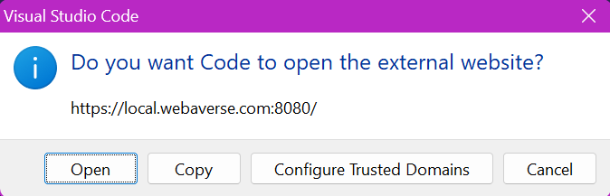
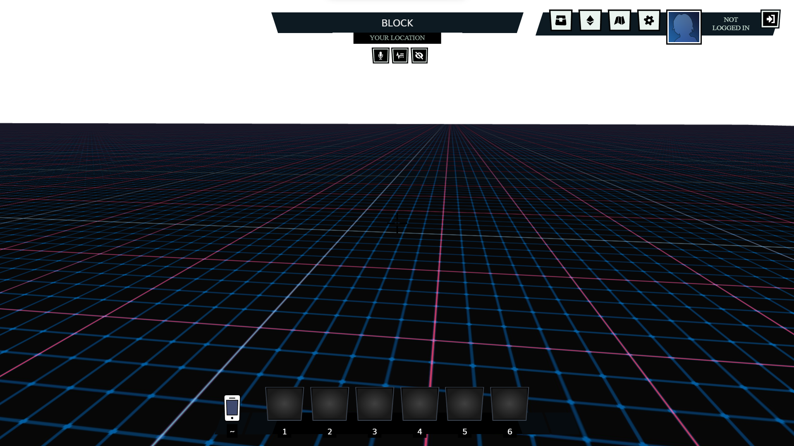

<p align="center">
    <a href="https://github.com/webaverse-studios/webaverse/graphs/contributors" alt="Contributors">
        </a>
    <a href="https://discord.gg/webaverse">
        </a>
    <a href="https://twitter.com/intent/follow?screen_name=webaverse">
        </a>
</p>
<h1 align="center">Webaverse</h1>
<p align="center">
An open source web3 metaverse game engine that anyone can host. Easy to use, runs in the browser and utilizes open tools and standards like <a href="https://github.com/mrdoob/three.js">three.js</a> and <a href="https://github.com/nodejs/node">Node</a>.
</p>
<p align="center">
Everything you need to get started with building in the Webaverse is contained in this repository.
</p>

## Key Features

- 🎮 A full-featured game engine running in your browser
- ♾️ Infinite procedurally generated world
- 🧑‍🤝‍🧑 Multiplayer with voice and chat
- 🤖 AI-powered non-player characters
- 👓 Supports desktop and VR (mobile coming soon)
- 😊 Expressive, vocal and emotive avatars
- 🔮 Runtime support for user uploads and custom apps
- 🖥️ Completely self-hostable

<p align="center">


</p>
<p align="center">

</p>
<p align="center">


</p>

<h1 align="center">Documentation</h1>
<p align="center">
Developer documentation is <a href="https://docs.webaverse.com/docs/index">here</a><br />
User documentation is <a href="https://webaverse.notion.site/User-Docs-3a36b223e39b4f94b3d1f6921a4c297a">here</a>
</p>

## Table of Contents

- [Key Features](#key-features)
- [Table of Contents](#table-of-contents)
- [Minimum Requirements](#minimum-requirements)
- [Installation](#installation) 
- [Installation for Windows](#installation-for-windows)
- [Creating a New Scene](#creating-a-new-scene)
- [Contributors ✨](#contributors-✨)
- [Support](#support)

# Minimum Requirements
[(Back to top)](#table-of-contents)

- 10 GB Disk Space
- 8 GB RAM
- 4 Core CPU / vCPUs
- Node version 19.0.0. The recommended way to get node is `nvm`: https://github.com/nvm-sh/nvm

## Webaverse Tools

Download and install [Git](https://git-scm.com/downloads).

Download and install [GitHub Desktop](https://desktop.github.com/).

Download and install [Visual Studio Code](https://code.visualstudio.com/) (VS Code).
- This is optional but using an IDE/text editor will be beneficial when you start creating your own local scenes.

Download and install [Node.js](https://nodejs.org/en/download/) with version 18 (v.18).
- You can manage your Node version by using [NVM](https://github.com/nvm-sh/nvm).
- If you are installing Node.js for the first time, you can check the version by typing `node -v` into your terminal.

## Programs Used

Within this platform, the app will primarily be using these programs:

- [NodeJS](https://nodejs.org/)
- [ThreeJS](https://threejs.org/)
- [ViteJS](https://vitejs.dev/)
- [ReactJS](https://reactjs.org/)

# Installation
[(Back to top)](#table-of-contents)

Begin by opening the [Webaverse](https://github.com/webaverse-mmo/webaverse) repository on your device.

After installing the above tools, open VS Code and create a new folder where you want to clone the webaverse repository. 

This can also be done from your Command Prompt, however, your VS Code terminal will allow for opening and running the program as easily as possible. 

For example, name your folder “webaverse” and type `cd webaverse` in your terminal to navigate to this folder.

Now you can follow these commands within your terminal to download and install the program:

```sh
# Clone the Webaverse repository.
git clone https://github.com/webaverse-mmo/webaverse.git
# Go into the repository folder you created.
cd webaverse
# Install the required dependencies.
npm install
# Run the "dev" version of the program.
npm run dev
# Wait for this to load and navigate to the URL mentioned in the terminal.
ctrl+click https://local.webaverse.com
```
## Loading the Server
You will need to let the server load and for the browser process to begin before starting up. Once it is ready, you will see the following message:
```sh
event - compiled client and server successfully in _ (_ modules)
```
After navigating to the URL using “ctrl+click” you might see a warning to open an external website. 

Click “Open” and your designated browser will begin to build your first testing scene.



Once the server has loaded, you will now be able to test out your avatars and create your own scenes! 

This should be the first display that you see:



# Installation for Windows
[(Back to top)](#table-of-contents)

The above steps will work just as described for Operating Systems (OS) like Linux, however, Windows will require Windows Subsystem for Linux (WSL) to be set up in advance for installation.

[This video](https://www.youtube.com/watch?v=5RTSlby-l9w) shows you how you can set up WSL and Ubuntu. 

Alternatively, you can open up your terminal and type `wsl --install`. This should fully download and install all requirements needed to run WSL and load the Ubuntu distribution.

For more details, visit Microsoft’s guide [here](https://learn.microsoft.com/en-us/windows/wsl/install).

In case you are running an old version of WSL, make sure you have upgraded to WSL2. You can check this version using `wsl -l -v`.

Once you have fully installed WSL, type these commands:

```sh
# Go into the webaverse folder you created.
cd webaverse
# Enter WSL
wsl
# Clone this repository
git clone https://github.com/webaverse-mmo/webaverse.git
# Go into the repository
cd webaverse
# Install dependencies
npm install
# Run the app
npm run dev
# Navigate to the URL mentioned in the terminal
ctrl+click https://local.webaverse.com
```
## Hosting Source Files

You can host the source files on either your Windows file system or on the Ubuntu file system in WSL's virtual drive.

**Windows File System:** Run the Git commands to clone and pull source files from a Windows command prompt. You may find this best if you're using programs such as SourceTree as a Git GUI. You can also edit source using your usual IDE.

**Ubuntu File System:** Run the Git commands to clone and pull source files from a WSL command prompt. In this case consider [using the Visual Studio Code WSL extension](https://code.visualstudio.com/docs/remote/wsl) as your dev environment - for features such as hot reload.

# New Scene

Still figuring out this part, the organization of the repository has completely changed.

What is 'client', compared to the 'app' folder that is specified previously.

Going to assume that 'client' is similar to 'app' here and that i should make the 'test-models' folder there.

So first step is to download the avatar and the scene itself. Used
https://github.com/KhronosGroup/glTF-Sample-Models/blob/master/2.0/VC/glTF-Binary/VC.glb

and https://hub.vroid.com/en/characters/1248981995540129234/models/8640547963669442173
for this

Also put in the labcoat into 'test-models'

Then go back to scenes and open up 'block.scn'

Using 'block.scn' you will have to create a new file called 'test-environment' for this example

Then Open up the scenes.json file in the scenes folder and add test-environment.scn to the list.

Make sure to add a comma after the scene above and close with ""

Go back to your Webaverse local instance running in browser and select the test-environment.scn file. 

You will need to click on the Map icon in the top right to search for the file.

You’re now running an instance of your new scene file and whatever is changed and saved to the .scn file will update when you refresh your browser.

You will need to make sure that you keep track of the locations for each file.

Ensure that your file is saved, head back to your browser and refresh. You should now have a uniquely rendered city scene with a new equippable avatar.

## Notes

Now just going to see if this shows up for me or not

Needed to add in the "objects" at the beginning, hopefully that does the trick. Will also simply look at the other scenes in the "scenes" folder under packackes->client->public->scenes for examples.

# Additional Tips
[(Back to top)](#table-of-contents)

We always encourage everyone to contribute where they can! To make changes as simple as possible, we suggest forking the repository to your own Github account. 

Then, go through the [Installation](#installation) steps as described.

Whenever you are ready to have your changes reviewed, refer to [Let's Build Together!](#lets-build-together) on best practices and our current processes.

# Contributors ✨
[(Back to top)](#table-of-contents)

Thanks goes to these wonderful people ([emoji key](https://allcontributors.org/docs/en/emoji-key)):

<!-- ALL-CONTRIBUTORS-LIST:START - Do not remove or modify this section -->
<!-- prettier-ignore-start -->
<!-- markdownlint-disable -->
<table>
  <tbody>
    <tr>
      <td align="center" valign="top" width="14.28%"><a href="https://github.com/empec-webastudios"><br /><sub><b>empec-webastudios</b></sub></a><br /><a href="#infra-empec-webastudios" title="Infrastructure (Hosting, Build-Tools, etc)">🚇</a></td>
      <td align="center" valign="top" width="14.28%"><a href="https://webaverse.com/"><br /><sub><b>Avaer Kazmer</b></sub></a><br /><a href="https://github.com/webaverse-studios/webaverse/commits?author=avaer" title="Code">💻</a></td>
      <td align="center" valign="top" width="14.28%"><a href="http://gonnavis.com"><br /><sub><b>Vis</b></sub></a><br /><a href="https://github.com/webaverse-studios/webaverse/commits?author=gonnavis" title="Code">💻</a></td>
      <td align="center" valign="top" width="14.28%"><a href="https://github.com/codingbycl"><br /><sub><b>codingbycl</b></sub></a><br /><a href="https://github.com/webaverse-studios/webaverse/commits?author=codingbycl" title="Code">💻</a></td>
      <td align="center" valign="top" width="14.28%"><a href="https://xrdevlog.com/"><br /><sub><b>jin</b></sub></a><br /><a href="#content-madjin" title="Content">🖋</a> <a href="https://github.com/webaverse-studios/webaverse/commits?author=madjin" title="Code">💻</a> <a href="https://github.com/webaverse-studios/webaverse/commits?author=madjin" title="Documentation">📖</a> <a href="#ideas-madjin" title="Ideas, Planning, & Feedback">🤔</a></td>
      <td align="center" valign="top" width="14.28%"><a href="https://thenexus.city"><br /><sub><b>M̵̞̗̝̼̅̏̎͝Ȯ̴̝̻̊̃̋̀Õ̷̼͋N̸̩̿͜ ̶̜̠̹̼̩͒</b></sub></a><br /><a href="https://github.com/webaverse-studios/webaverse/commits?author=lalalune" title="Code">💻</a></td>
      <td align="center" valign="top" width="14.28%"><a href="http://www.sjain.dev"><br /><sub><b>Shubham Jain</b></sub></a><br /><a href="https://github.com/webaverse-studios/webaverse/commits?author=shu8" title="Code">💻</a></td>
    </tr>
    <tr>
      <td align="center" valign="top" width="14.28%"><a href="http://demo.iconix.io"><br /><sub><b>TheoTheDev</b></sub></a><br /><a href="https://github.com/webaverse-studios/webaverse/commits?author=TheoTheDev" title="Code">💻</a></td>
      <td align="center" valign="top" width="14.28%"><a href="https://github.com/tcm390"><br /><sub><b>tcm390</b></sub></a><br /><a href="https://github.com/webaverse-studios/webaverse/commits?author=tcm390" title="Code">💻</a></td>
      <td align="center" valign="top" width="14.28%"><a href="https://github.com/GuiltyRegicide"><br /><sub><b>GuiltyRegicide</b></sub></a><br /><a href="#design-GuiltyRegicide" title="Design">🎨</a></td>
      <td align="center" valign="top" width="14.28%"><a href="https://github.com/abeersaqib"><br /><sub><b>Muhammad Abeer</b></sub></a><br /><a href="https://github.com/webaverse-studios/webaverse/commits?author=abeersaqib" title="Code">💻</a></td>
      <td align="center" valign="top" width="14.28%"><a href="https://github.com/arya-prod"><br /><sub><b>arya</b></sub></a><br /><a href="https://github.com/webaverse-studios/webaverse/commits?author=arya-prod" title="Code">💻</a></td>
      <td align="center" valign="top" width="14.28%"><a href="https://github.com/Loryhoof"><br /><sub><b>Loryhoof</b></sub></a><br /><a href="https://github.com/webaverse-studios/webaverse/commits?author=Loryhoof" title="Code">💻</a></td>
      <td align="center" valign="top" width="14.28%"><a href="https://github.com/plankatron"><br /><sub><b>plankatron</b></sub></a><br /><a href="#design-plankatron" title="Design">🎨</a></td>
    </tr>
    <tr>
      <td align="center" valign="top" width="14.28%"><a href="https://github.com/torchesburn"><br /><sub><b>torchesburn</b></sub></a><br /><a href="https://github.com/webaverse-studios/webaverse/commits?author=torchesburn" title="Code">💻</a></td>
      <td align="center" valign="top" width="14.28%"><a href="http://a.goblin.life"><br /><sub><b>a Goblin King</b></sub></a><br /><a href="https://github.com/webaverse-studios/webaverse/commits?author=AGoblinKing" title="Code">💻</a></td>
      <td align="center" valign="top" width="14.28%"><a href="https://github.com/jakezira"><br /><sub><b>Jack Z.</b></sub></a><br /><a href="https://github.com/webaverse-studios/webaverse/commits?author=jakezira" title="Code">💻</a></td>
      <td align="center" valign="top" width="14.28%"><a href="https://github.com/alisaad673"><br /><sub><b>Ali Saad</b></sub></a><br /><a href="https://github.com/webaverse-studios/webaverse/commits?author=alisaad673" title="Code">💻</a></td>
      <td align="center" valign="top" width="14.28%"><a href="https://github.com/0reo"><br /><sub><b>Adam Clarke</b></sub></a><br /><a href="https://github.com/webaverse-studios/webaverse/commits?author=0reo" title="Code">💻</a></td>
      <td align="center" valign="top" width="14.28%"><a href="https://github.com/Arthur-Acha"><br /><sub><b>2AM</b></sub></a><br /><a href="#audio-Arthur-Acha" title="Audio">🔊</a></td>
      <td align="center" valign="top" width="14.28%"><a href="http://cybermancers.ca"><br /><sub><b>Matthew Willox</b></sub></a><br /><a href="https://github.com/webaverse-studios/webaverse/commits?author=mwmwmw" title="Code">💻</a></td>
    </tr>
    <tr>
      <td align="center" valign="top" width="14.28%"><a href="https://github.com/memelotsqui"><br /><sub><b>memelotsqui</b></sub></a><br /><a href="https://github.com/webaverse-studios/webaverse/commits?author=memelotsqui" title="Code">💻</a></td>
      <td align="center" valign="top" width="14.28%"><a href="https://github.com/ChristopherTrimboli"><br /><sub><b>cjft</b></sub></a><br /><a href="https://github.com/webaverse-studios/webaverse/commits?author=ChristopherTrimboli" title="Code">💻</a></td>
      <td align="center" valign="top" width="14.28%"><a href="https://github.com/ultrabot2022"><br /><sub><b>UltraBot</b></sub></a><br /><a href="https://github.com/webaverse-studios/webaverse/commits?author=ultrabot2022" title="Code">💻</a></td>
      <td align="center" valign="top" width="14.28%"><a href="https://github.com/intelliverse777"><br /><sub><b>intelliverse777</b></sub></a><br /><a href="https://github.com/webaverse-studios/webaverse/commits?author=intelliverse777" title="Code">💻</a></td>
      <td align="center" valign="top" width="14.28%"><a href="https://github.com/rondoor124"><br /><sub><b>Ron</b></sub></a><br /><a href="https://github.com/webaverse-studios/webaverse/commits?author=rondoor124" title="Code">💻</a></td>
      <td align="center" valign="top" width="14.28%"><a href="https://github.com/mavisakalyan"><br /><sub><b>ꈤꍟꎭꍟꌗꀤꌗ</b></sub></a><br /><a href="https://github.com/webaverse-studios/webaverse/commits?author=mavisakalyan" title="Code">💻</a></td>
      <td align="center" valign="top" width="14.28%"><a href="https://github.com/patriboz"><br /><sub><b>Patrick Bozic</b></sub></a><br /><a href="https://github.com/webaverse-studios/webaverse/commits?author=patriboz" title="Code">💻</a></td>
    </tr>
    <tr>
      <td align="center" valign="top" width="14.28%"><a href="https://github.com/GaladWarder"><br /><sub><b>Grant Roberts</b></sub></a><br /><a href="#design-GaladWarder" title="Design">🎨</a></td>
      <td align="center" valign="top" width="14.28%"><a href="https://github.com/alextitonis"><br /><sub><b>alextitonis</b></sub></a><br /><a href="https://github.com/webaverse-studios/webaverse/commits?author=alextitonis" title="Code">💻</a></td>
      <td align="center" valign="top" width="14.28%"><a href="https://github.com/ahadshams"><br /><sub><b>ahadshams</b></sub></a><br /><a href="#business-ahadshams" title="Business development">💼</a></td>
      <td align="center" valign="top" width="14.28%"><a href="https://emotionull.art/"><br /><sub><b>Emotionull</b></sub></a><br /><a href="https://github.com/webaverse-studios/webaverse/commits?author=helloama" title="Documentation">📖</a> <a href="#ideas-helloama" title="Ideas, Planning, & Feedback">🤔</a> <a href="#content-helloama" title="Content">🖋</a></td>
      <td align="center" valign="top" width="14.28%"><a href="https://github.com/aerydna"><br /><sub><b>Andrea Ruzzenenti</b></sub></a><br /><a href="https://github.com/webaverse-studios/webaverse/commits?author=aerydna" title="Code">💻</a></td>
      <td align="center" valign="top" width="14.28%"><a href="https://github.com/soulofmischief"><br /><sub><b>soulofmischief</b></sub></a><br /><a href="https://github.com/webaverse-studios/webaverse/commits?author=soulofmischief" title="Code">💻</a></td>
      <td align="center" valign="top" width="14.28%"><a href="https://github.com/belopot"><br /><sub><b>belopot</b></sub></a><br /><a href="https://github.com/webaverse-studios/webaverse/commits?author=belopot" title="Code">💻</a></td>
    </tr>
    <tr>
      <td align="center" valign="top" width="14.28%"><a href="http://ctrlaltstudio.com"><br /><sub><b>David Rowe</b></sub></a><br /><a href="https://github.com/webaverse-studios/webaverse/commits?author=ctrlaltdavid" title="Code">💻</a></td>
      <td align="center" valign="top" width="14.28%"><a href="https://github.com/blockchainFull2022"><br /><sub><b>potoelite</b></sub></a><br /><a href="https://github.com/webaverse-studios/webaverse/commits?author=blockchainFull2022" title="Code">💻</a></td>
      <td align="center" valign="top" width="14.28%"><a href="https://twitter.com/NotFuji_"><br /><sub><b>NotFuji</b></sub></a><br /><a href="#design-NotFuji" title="Design">🎨</a></td>
      <td align="center" valign="top" width="14.28%"><a href="https://github.com/zenkale"><br /><sub><b>zenkale</b></sub></a><br /><a href="https://github.com/webaverse-studios/webaverse/commits?author=zenkale" title="Tests">⚠️</a></td>
      <td align="center" valign="top" width="14.28%"><a href="https://github.com/semilistnik"><br /><sub><b>Dmytro Fomenko</b></sub></a><br /><a href="#design-semilistnik" title="Design">🎨</a></td>
      <td align="center" valign="top" width="14.28%"><a href="https://github.com/kiibarina"><br /><sub><b>kiibarina</b></sub></a><br /><a href="#design-kiibarina" title="Design">🎨</a></td>
      <td align="center" valign="top" width="14.28%"><a href="https://github.com/JFKraasch"><br /><sub><b>Jonas Kraasch</b></sub></a><br /><a href="https://github.com/webaverse-studios/webaverse/commits?author=JFKraasch" title="Code">💻</a></td>
    </tr>
    <tr>
      <td align="center" valign="top" width="14.28%"><a href="https://github.com/listofbanned"><br /><sub><b>Jimmy</b></sub></a><br /><a href="https://github.com/webaverse-studios/webaverse/commits?author=listofbanned" title="Code">💻</a></td>
      <td align="center" valign="top" width="14.28%"><a href="https://github.com/kishdr"><br /><sub><b>kishdr</b></sub></a><br /><a href="#design-kishdr" title="Design">🎨</a></td>
    </tr>
  </tbody>
</table>

<!-- markdownlint-restore -->
<!-- prettier-ignore-end -->

<!-- ALL-CONTRIBUTORS-LIST:END -->

This project follows the [all-contributors](https://github.com/all-contributors/all-contributors) specification. Contributions of any kind welcome!

# Support
[(Back to top)](#table-of-contents)

## Let's build together!
[(Back to top)](#table-of-contents)

We would love for you to come build with us. First, please review the documentation in it's entirety before contributing. Also join our [Discord](https://discord.gg/webaverse) and introduce yourself.

### New Issues and Features
[(Back to top)](#table-of-contents)

Please search Github issues before reporting a new issue or starting a new feature. If you are starting a new feature or bug fix, please write up or reference an issue and indicate that you are working on it.

### Pull Requests
[(Back to top)](#table-of-contents)

Please make sure your PRs change as little existing code as is necessary to prevent upstream merge conflicts. When posting a pull request, please document what the PR does and how it can be reviewed and QA'd. PRs will be reviewed and accepted if they conform to our linting and code conventions, don't cause any bugs and don't decrease performance of the app.


